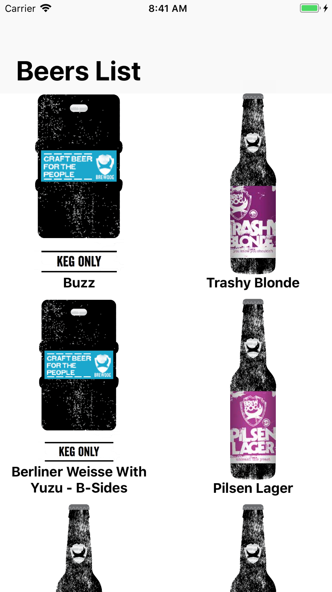
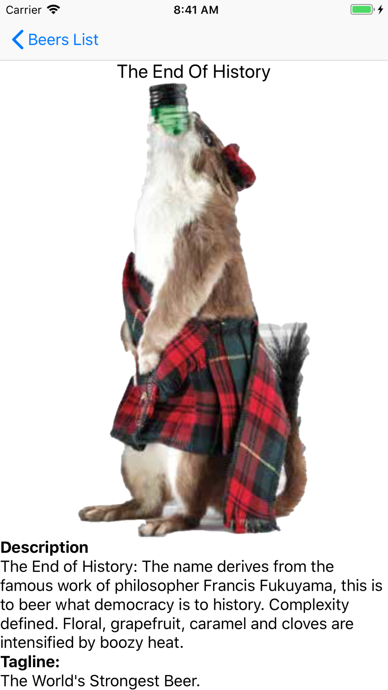

# ObjectiveC_CollectionView

The project uses [Punk API] (https://punkapi.com), as a data soruce for the collection view. The project has two screens, a list screen and detail screen. The list screen displays the list of beers names and their images in a grid view format. When the image is clicked on, the detail screen appears. The detail screen provides more information such as the description and tagline of the selected beer.  The code is written in ObjectiveC.

# Screenshots

